# Beatquest  
### Professional Certification Report  
*Submitted as part of the final evaluation for the Moonshot program.*

# Table of Contents

1. [Comprehensive Presentation of the Professional Project](#1-comprehensive-presentation-of-the-professional-project)
   - 1.1 Project Overview
   - 1.2 Target Audience and Educational Goals
   - 1.3 Key Features
   - 1.4 Individual Responsibility and Tools

2. [Analysis and Software Specifications](#2-analysis-and-software-specifications)
   - 2.1 Functional Requirements
   - 2.2 Technical and Non-Functional Requirements
   - 2.3 User Flow and Use Case Scenarios
   - 2.4 Project Constraints

3. [Software Architecture Choices](#3-software-architecture-choices)
   - 3.1 Global System Overview
   - 3.2 Frontend Architecture (Flutter)
   - 3.3 Backend Architecture (Crow / C++)
   - 3.4 Database Design and Security
   - 3.5 API Design

4. [Algorithm Selection and Relevance](#4-algorithm-selection-and-relevance)
   - 4.1 Beatmatching and BPM Detection
   - 4.2 Real-Time Feedback Logic
   - 4.3 Gamification and Scoring System
   - 4.4 Technical Justification

5. [Testing and Deployment Strategy](#5-testing-and-deployment-strategy)
   - 5.1 Unit and Integration Testing
   - 5.2 Audio Feedback Testing
   - 5.3 Deployment Approach
   - 5.4 CI/CD and Version Control

6. [Software Evolutions](#6-software-evolutions)
   - 6.1 Completed Milestones
   - 6.2 Planned Enhancements
   - 6.3 Post-Certification Roadmap

7. [Project Management and Execution](#7-project-management-and-execution)
   - 7.1 Project Timeline
   - 7.2 Lessons Learned
   - 7.3 Risk Management and Adjustments
   - 7.4 Acknowledgments
   - 7.5 Conclusion

8. [Glossary](#8-glossary)

## 1.1 Project Overview

Beatquest is a mobile application developed to teach users the fundamentals and techniques of DJing through an interactive and gamified learning experience. The idea was born from personal frustration: despite a strong interest in electronic music, I found it difficult to progress as a self-taught DJ. Online tutorials were scattered, repetitive, and lacked real-time feedback. There was no structured learning path to build DJ skills progressively, nor any guidance during practice sessions.

This project is the result of that experience: an effort to fill a gap in DJ education by creating a tool that makes DJing more accessible, structured, and motivating. Beatquest transforms the way beginners learn to mix by offering interactive lessons, performance feedback, and gamification mechanics—all in a single mobile platform. It aims to democratize DJing and empower users to develop their skills independently with the support of instant evaluation and engaging challenges.

## 1.2 Target Audience and Educational Goals

The application is intended for complete beginners to intermediate-level learners who want to gain DJ skills from scratch or improve their technique. It targets users who may not have access to physical DJ equipment or formal training but are passionate about music and willing to learn independently. The app aims to:
- Make DJing accessible and affordable
- Provide a structured learning path with increasing difficulty
- Offer feedback mechanisms to help users self-correct
- Create a motivating learning environment through gamification

## 1.3 Key Features

Beatquest includes the following core features:
- **Interactive Lessons:** Modular content combining theory and practice
- **Quizzes & Challenges:** Reinforce theoretical understanding and reward progress
- **Real-Time Audio Feedback:** Analyze BPM, beatmatching, and timing
- **Gamification:** Level-up system, XP rewards, streaks, and progress tracking
- **User Profile & History:** Track completed lessons, scores, and feedback
- **Session Playback:** Users can listen back to their performances

The diagram below shows how Beatquest’s core features directly support the educational goals of the application. It visually links user expectations with the features implemented to fulfill them.

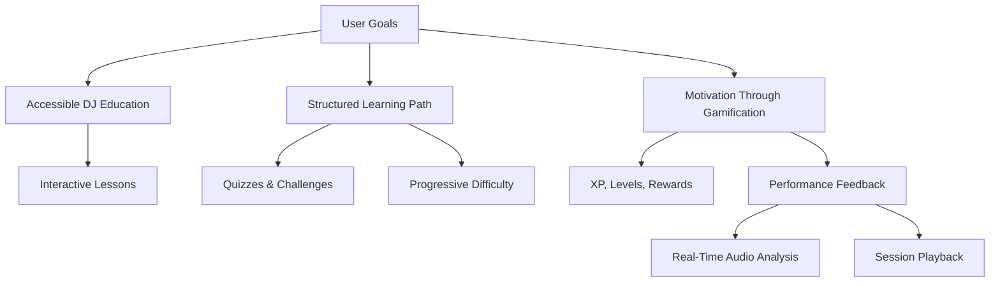

## 1.4 Individual Responsibility and Tools

This project was developed individually over a span of several weeks. The following tasks were performed entirely by the author:
- Market analysis and feature definition
- Mockups and UX flow (Figma)
- Frontend development with Flutter
- REST API development using Crow (C++)
- Database setup with PostgreSQL and RLS policies
- Basic AI prototype using Librosa for audio feedback
- Testing with curl, Postman, and manual QA
- Project documentation and report writing

Main tools and technologies used:
- Flutter, Dart
- Crow C++ framework
- PostgreSQL + Docker Compose
- Git & GitHub (for CI and versioning)
- Notion, Figma, VS Code

The diagram below presents the main development phases of the Beatquest project, offering a simple view of how the project evolved from idea to delivery.

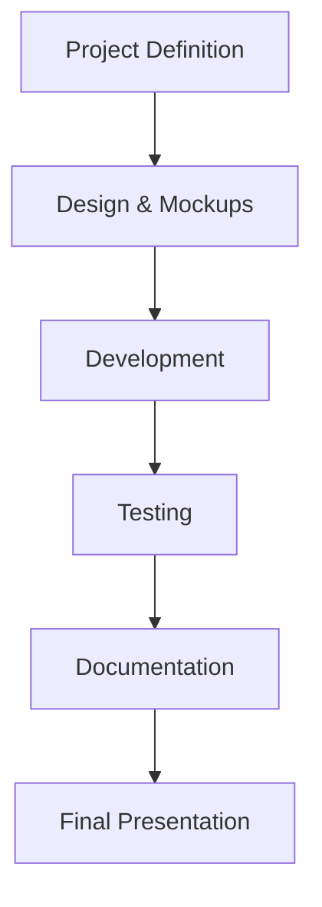


# 2. Analysis and Software Specifications

## 2.1 Functional Requirements

The main features required for Beatquest were identified during early benchmarking and user analysis:

- **User Account Management:** Users can register, log in, and securely access their data.
- **Lesson Navigation:** Users progress through lessons that include theory, practice, and quizzes.
- **Audio Feedback Engine:** The app processes real-time audio to provide feedback on beatmatching and timing.
- **Gamification System:** Users earn XP, unlock levels, and maintain streaks.
- **Session Tracking:** Playback and results are stored and displayed in user profiles.
- **Admin Content Management:** Admins can add, remove, or update lesson content dynamically.

## 2.2 Technical and Non-Functional Requirements

### Technical Requirements:
- **Cross-platform Compatibility:** Flutter ensures native performance on both Android and iOS.
- **API Integration:** Communication between frontend and backend via REST.
- **Secure Authentication:** JWT-based authentication system.
- **Database:** PostgreSQL with Role-Level Security (RLS) to isolate user data.

### Non-Functional Requirements:
- **Responsiveness:** Smooth and reactive UI on all screen sizes.
- **Low Latency:** Audio feedback must process input with minimal delay.
- **Scalability:** The backend architecture should support future features like multiplayer or cloud storage.
- **Data Privacy:** Each user's session history and profile must be protected and isolated.

| Requirement Type             | Feature / Concern                                                       | Description                                                                                  |
|-----------------------------|--------------------------------------------------------------------------|----------------------------------------------------------------------------------------------|
| Functional Requirement       | User Account Management                                                  | Users can register, log in, and manage their secure personal data.                          |
| Functional Requirement       | Lesson Navigation                                                        | Users access and navigate through a structured lesson sequence (theory + practice).         |
| Functional Requirement       | Quizzes and Challenges                                                   | Users validate their understanding through interactive questions and challenges.            |
| Functional Requirement       | Audio Feedback Engine                                                    | Real-time processing of the user's mix to detect timing and beatmatching accuracy.          |
| Functional Requirement       | Gamification System                                                      | Users gain XP, unlock new levels, and track progress through a gamified interface.          |
| Functional Requirement       | Session Tracking                                                         | Playback of recorded sessions and display of results in the user profile.                   |
| Functional Requirement       | Admin Content Management                                                 | Admins can upload, delete, and update lesson materials dynamically.                         |
| Non-Functional Requirement   | Cross-Platform Compatibility                                             | The app must work on both Android and iOS devices using Flutter.                            |
| Non-Functional Requirement   | Secure Authentication                                                    | JWT tokens are used to protect user sessions and route access.                              |
| Non-Functional Requirement   | Low Latency Audio Processing                                             | Audio input and feedback must be near real-time for effective user correction.              |
| Non-Functional Requirement   | UI Responsiveness                                                        | Interface should be smooth, adaptive to screen size, and load content quickly.              |
| Non-Functional Requirement   | Data Privacy & Security                                                  | User data must be securely stored and isolated using PostgreSQL RLS policies.               |
| Non-Functional Requirement   | Scalable Backend                                                         | The backend structure must allow future evolution (e.g., multiplayer mode, cloud sync).     |
| Non-Functional Requirement   | Maintainability                                                          | The codebase should be modular, documented, and easy to update or extend.                   |
| Non-Functional Requirement   | Offline Usage (Optional Future Goal)                                     | Basic lesson content should remain accessible offline for better accessibility.             |

## 2.3 User Flow and Use Case Scenarios

### User Personas

The following personas illustrate typical users targeted by Beatquest, with different motivations, skill levels, and behavior patterns.

#### Persona 1 – Alex, 17 years old – High School Student (Beginner)

| Attribute        | Description |
|------------------|-------------|
| **Profile**      | No prior music training. Uses a mid-range Android smartphone. |
| **Goal**         | Wants to learn how to mix for fun and share DJ snippets on TikTok. |
| **Behavior**     | Starts with beginner lessons. Fails some quizzes but enjoys the audio feedback. Motivated by level-ups and XP rewards. |
| **Needs**        | Clear instructions, simplified vocabulary, gamified motivation, and visual feedback. |

**Use Case – Starting the First Lesson**

- **Actor**: Alex, 17, beginner user  
- **Precondition**: Has created an account and logged into the app  
- **Steps**:  
  1. Opens the dashboard and selects the first lesson in the tree  
  2. Reads the theoretical content  
  3. Takes the introductory quiz  
  4. Enters the practice mode with simplified decks  
  5. Records a 30s session and receives instant feedback  
- **Postcondition**: Gains XP, unlocks the next lesson, and sees his score  

---

#### Persona 2 – Clara, 26 years old – Music School Student (Intermediate)

| Attribute        | Description |
|------------------|-------------|
| **Profile**      | Strong theoretical background but no experience with DJ gear. Owns an iPhone. |
| **Goal**         | Wants to apply rhythm theory and develop DJ practice. |
| **Behavior**     | Jumps into intermediate lessons. Skips theory when possible. Uses playback sessions to self-review. |
| **Needs**        | Accurate sync feedback, flexible lesson navigation, and time-efficient sessions. |

**Use Case – Reviewing Progress and Practicing**

- **Actor**: Clara, 26, music school student  
- **Precondition**: Has already completed at least 5 lessons  
- **Steps**:  
  1. Opens the Profile screen and reviews her XP and score trends  
  2. Selects a past session to replay and view mistakes  
  3. Returns to that lesson to redo the quiz and practice deck  
- **Postcondition**: Improves her score and confirms learning through repetition  

---

#### Persona 3 – Karim, 34 years old – Engineer and Hobbyist (Advanced User)

| Attribute        | Description |
|------------------|-------------|
| **Profile**      | DJs recreationally using Traktor for 2 years. Tech-savvy and goal-driven. |
| **Goal**         | Wants to test and improve technique, and validate theoretical gaps. |
| **Behavior**     | Focuses on quizzes and performance tests. Reviews sessions for precision. Tracks progression numerically. |
| **Needs**        | Reliable beat analysis, exportable performance stats, advanced feedback visuals. |

**Use Case – Pushing Limits with Performance Test**

- **Actor**: Karim, 34, hobbyist DJ  
- **Precondition**: Has completed the core curriculum and unlocked advanced tracks  
- **Steps**:  
  1. Selects the “Challenge Mode” lesson for advanced transitions  
  2. Skips theory, jumps straight to practice  
  3. Uploads his recorded mix  
  4. Receives beat grid analysis, waveform alignment, and detailed scoring  
- **Postcondition**: Achieves a high score, earns a gold badge, and moves up on the leaderboard  


The following diagram illustrates the main user journey from app launch to feedback:

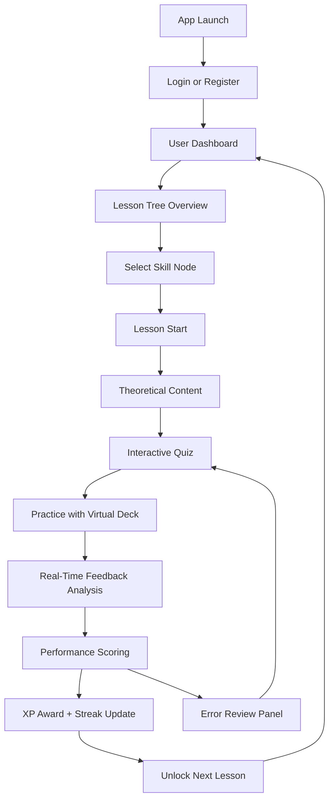

### Sample Screens – Lesson and Feedback Experience

Below is a curated selection of screens illustrating key learning interactions inside Beatquest:

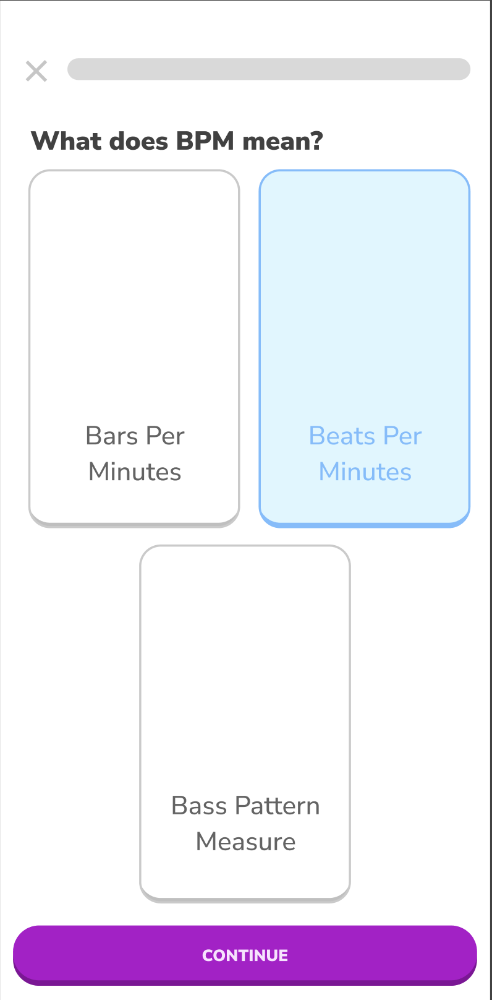
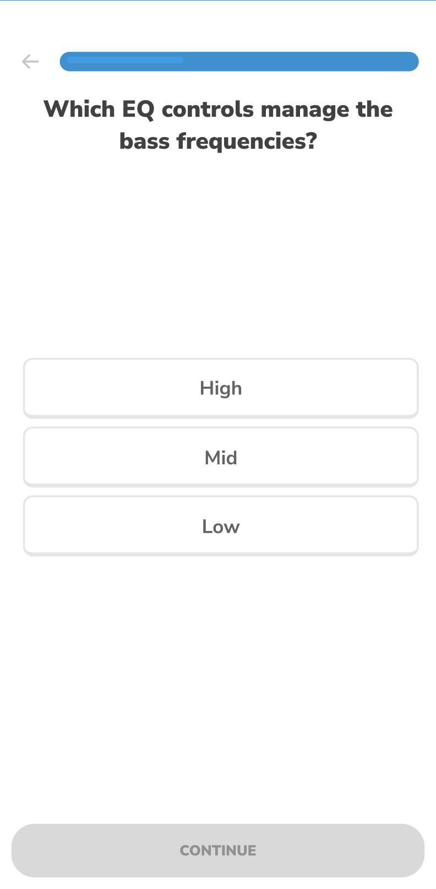

<br>
<em>→ Two examples of multiple-choice questions testing theoretical understanding and reinforcing progress visually.</em>

<br>

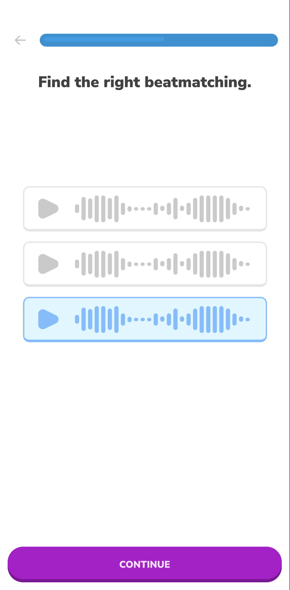
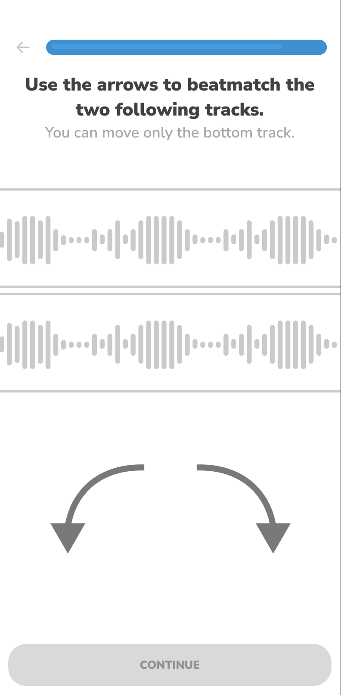

<br>
<em>→ Beatmatching exercises in two formats: MCQ identification and interactive waveform timing practice.</em>

<br>

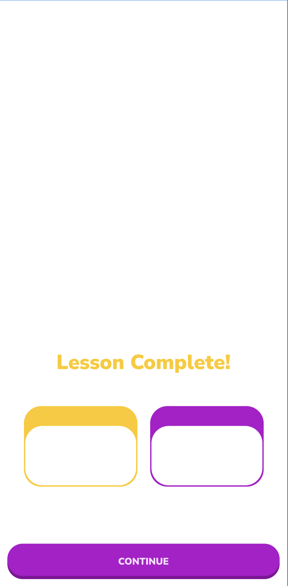

<br>
<em>→ Session recap screen showing feedback, score summary, and progress tracking via XP.</em>

## 2.4 Project Constraints

- **Solo Developer:** All aspects of development (design, backend, frontend, AI) were handled by a single person, requiring time prioritization and scope control.
- **Time Limit:** The project had to be completed and presented by June 23, 2025, with a feature-complete build by June 9.
- **Hardware Limitations:** Audio feedback had to be designed for standard smartphones without external DJ controllers.
- **Budget Constraints:** The project was developed with minimal financial resources, relying on free or open-source tools and libraries.
- **Technical Complexity:** Implementing real-time audio analysis and feedback required careful selection of libraries and optimization for mobile performance.


# 3. Software Architecture Choices

## 3.1 Global System Overview

Beatquest follows a modular, service-oriented architecture that separates concerns between frontend, backend, database, and AI components. This decoupling enables independent development, easier testing, and potential future scalability (e.g., adding a web interface or multiplayer mode).

The overall architecture is composed of the following layers:
- **Frontend:** Developed in Flutter to run on Android and iOS.
- **Backend API:** Built with the Crow framework in C++ for high performance and minimal memory usage.
- **Database:** PostgreSQL, using RLS (Row-Level Security) for secure and isolated user data.
- **Audio Processing Prototype:** Developed with Python and Librosa during the prototyping phase, with planned migration to a mobile-native C++ module.

The following diagram illustrates the main components and their interactions in the Beatquest architecture:

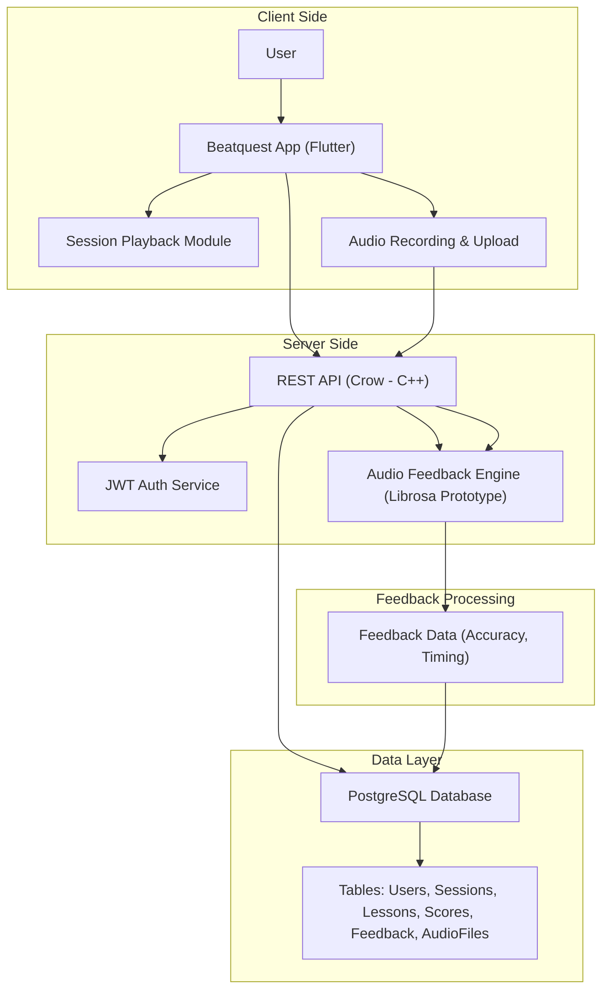


## 3.2 Frontend Architecture (Flutter)

The frontend is a mobile application developed in Flutter. It uses:
- **Riverpod** for state management
- **Navigator 2.0** for page routing and dynamic lesson flows
- **Custom Widgets** for decks, waveforms, and BPM indicators
- **REST API integration** with async handling using `http` and `dio`

UI is structured into modules (Home, Lessons, Session Playback, Profile). Each module is reactive and supports responsive layout for different screen sizes.

#### Why Flutter?

Flutter was selected because of its key benefits:
- **Cross-platform performance**: single codebase for both Android and iOS
- **Hot reload**: fast iteration and debugging
- **UI consistency**: pixel-perfect rendering powered by Skia engine
- **Modular components**: easy separation of views and logic

The following diagram illustrates the main UI modules and navigation logic in the Beatquest Flutter app:

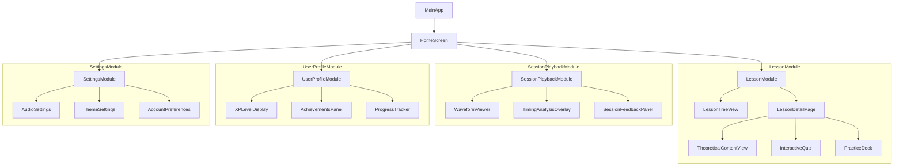

## 3.3 Backend Architecture (Crow / C++)

The backend is built with the lightweight Crow web framework, selected for its speed, minimalism, and native C++ compatibility with potential real-time audio modules. It includes:
- **JWT authentication middleware**
- **RESTful routes**: `/register`, `/login`, `/me/sessions`, `/lessons`, `/leaderboard`
- **Layered codebase**: routing layer, services (logic), and data access objects
- **JSON responses** using Crow's integrated serializers

All endpoints are tested using curl/Postman and validated against typical edge cases (missing fields, invalid tokens, unauthorized access).

The following diagram shows the main backend API routes, their controllers, and the flow through services and modules:
#### Code Example – Crow Route Declaration

Below is a simplified example of how an API route is declared using the Crow framework:

```cpp
CROW_ROUTE(app, "/login").methods("POST"_method)
([](const crow::request& req){
    auto body = crow::json::load(req.body);
    if (!body) return crow::response(400);
    
    std::string email = body["email"].s();
    std::string password = body["password"].s();
    
    // Authenticate and return token...
    return crow::response(200, R"({"token":"fake_jwt_token"})");
});
```
This shows how user input is parsed and a response is returned in JSON format.

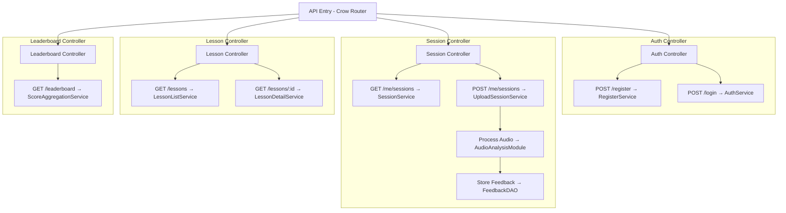

## 3.4 Database Design and Security

The application uses PostgreSQL with:
- **Structured schema**: tables for users, sessions, lessons, scores
- **Row-Level Security (RLS)**: enforced per user to ensure data isolation
- **Role separation**: admin (read/write all), user (read/write own), and anonymous (register only)
- **Migration scripts** using SQL files for reproducibility and version control

The following ER diagram presents the main tables and relationships in the Beatquest PostgreSQL schema:

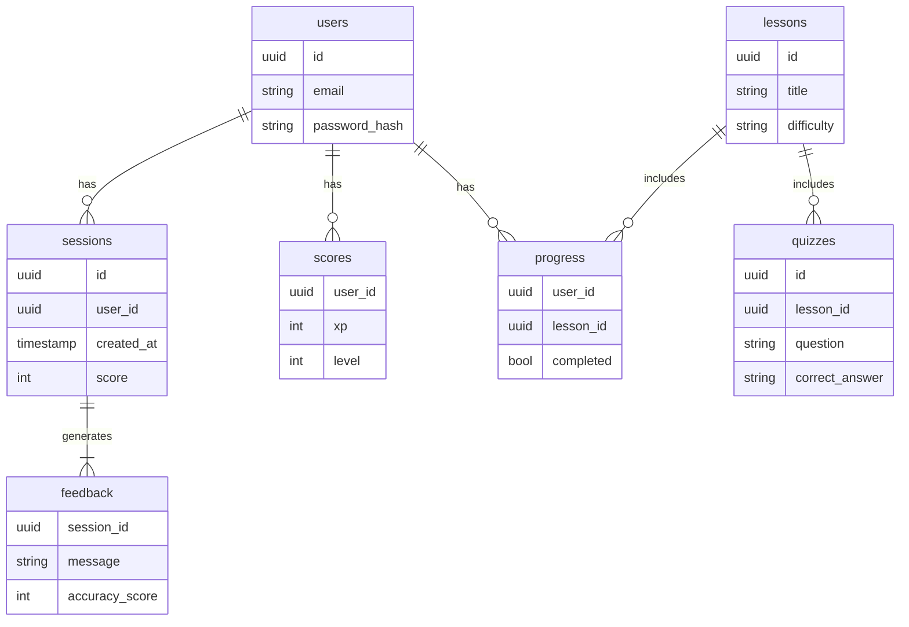


## 3.5 API Design

The REST API adheres to RESTful conventions:
- **Stateless requests**, always authorized with JWT in the header
- **Clear naming conventions**, e.g., `GET /lessons/:id`, `POST /me/sessions`
- **Error handling** with standardized JSON error responses
- **Secure access control**, thanks to token validation and DB role enforcement


Example response structure:
```json
{
  "success": true,
  "data": {
    "session_id": "abc123",
    "score": 85,
    "feedback": "Try to align beats earlier in the intro."
  }
}
```

→ Sample request/response pairs are provided below.

**Register (POST /register)**
**Request:**
```json
{
  "email": "test@example.com",
  "password": "hunter2"
}
```
**Response:**
```json
{
  "success": true,
  "data": {
    "user_id": "e6ac7c4d-9f8b-4e2d-b2c0-2b2e6e5e2d1a",
    "token": "eyJhbGciOiJIUzI1..."
  }
}
```

**Login (POST /login)**
**Request:**
```json
{
  "email": "test@example.com",
  "password": "hunter2"
}
```
**Response:**
```json
{
  "success": true,
  "data": {
    "user_id": "e6ac7c4d-9f8b-4e2d-b2c0-2b2e6e5e2d1a",
    "token": "eyJhbGciOiJIUzI1..."
  }
}
```

**Get Lessons (GET /lessons)**
**Response:**
```json
{
  "success": true,
  "data": [
    {
      "id": "1",
      "title": "Intro to Beatmatching",
      "difficulty": "beginner"
    },
    {
      "id": "2",
      "title": "BPM and Tempo",
      "difficulty": "beginner"
    }
  ]
}
```

**Get Session Feedback (GET /me/sessions/:id)**
**Response:**
```json
{
  "success": true,
  "data": {
    "session_id": "abc123",
    "score": 85,
    "feedback": "Try to align beats earlier in the intro.",
    "timing_errors": [
      { "timestamp": "00:12", "type": "early" },
      { "timestamp": "00:45", "type": "late" }
    ]
  }
}
```


**Error Example (unauthorized)**
```json
{
  "success": false,
  "error": {
    "code": 401,
    "message": "Unauthorized: Invalid or missing token."
  }
}
```

---

### Additional Notes and Error Handling

To ensure robustness, the API is designed with standardized error responses and clear HTTP status codes. Below are examples to help understand how different error scenarios are handled.

#### Example – Invalid Token (401 Unauthorized)

**Request:**
```http
GET /me/sessions
Authorization: Bearer INVALID_TOKEN
```

**Response:**
```json
{
  "success": false,
  "error": {
    "code": 401,
    "message": "Unauthorized: Invalid or missing token."
  }
}
```

#### Example – Missing Fields (400 Bad Request)

**Request:**
```json
POST /register
{
  "email": "incomplete@example.com"
}
```

**Response:**
```json
{
  "success": false,
  "error": {
    "code": 400,
    "message": "Missing required field: password"
  }
}
```

#### Example – Invalid Endpoint (404 Not Found)

**Request:**
```http
GET /unknown/route
```

**Response:**
```json
{
  "success": false,
  "error": {
    "code": 404,
    "message": "Endpoint not found"
  }
}
```

### Response Time and Format Guidelines

- All API responses follow a consistent format with `"success"`, `"data"` or `"error"` keys.
- Time-sensitive routes (e.g., session uploads) aim for a processing time under 300ms.
- Authentication-protected routes return clear 401/403 codes on failure to authorize.

---

This annex complements the main backend description by providing practical test cases and simulating real-world usage. It also improves readiness for future API testing automation.


# 4. Algorithm Selection and Relevance

## 4.1 Beatmatching and BPM Detection

Although the feedback engine was not implemented during this certification phase, a detailed plan has been outlined for its future development. The beat analysis module will play a central role in providing real-time performance feedback.

### Planned Implementation

- **Input Format:** Recorded audio sessions will be uploaded by the user from within the app in WAV or MP3 format.
- **Preprocessing:** Audio normalization and silence trimming will be applied before analysis.
- **BPM Estimation:** Using onset envelope detection and tempo autocorrelation, either via Librosa or a C++ DSP library.
- **Beat Detection:** Extract beat positions using dynamic thresholding and peak picking methods.
- **Reference Grid Comparison:** Each lesson will have a predefined beat grid for expected timing. Detected user beats will be compared to this template.
- **Deviation Metrics:** Timing differences will be computed and classified as early, late, or on-beat.
- **Session Scoring:** Weighted formula based on BPM accuracy, beat alignment, and continuity (e.g., no large gaps).
- **Textual Feedback Generator:** Templates such as "Great timing at 0:30", or "Beat drift near 1:10" will be matched with detected errors.

#### Librosa Example Snippet

Below is a sample code that illustrates tempo and beat detection using Librosa:

```python
import librosa

y, sr = librosa.load("mix_session.wav")
tempo, beats = librosa.beat.beat_track(y=y, sr=sr)
beat_times = librosa.frames_to_time(beats, sr=sr)

print(f"Estimated tempo: {tempo}")
print(f"Detected beats at: {beat_times}")
```

This would eventually feed the feedback scoring algorithm by aligning beat_times with expected beat grids.

### Prototyping Plan

- Phase 1: Build CLI prototype with Librosa or Aubio to process .wav files
- Phase 2: Generate beatmap JSON and error logs for frontend visualization
- Phase 3: Integrate into backend pipeline, replacing placeholder data with real analysis
- Phase 4: Optimize for mobile-native deployment using C++ if needed

> This algorithm will not run in real-time during lesson playback, but will analyze sessions after recording to ensure mobile performance.

## 4.2 Real-Time Feedback Logic

True real-time feedback remains a long-term goal for Beatquest. During the certification period, feedback was conceptualized as a **delayed evaluation system**, where sessions are uploaded and analyzed after recording. This decision ensures performance stability on mobile devices and simplifies audio processing constraints.

### Planned Feedback Workflow

1. **User completes a practice session** within the app (e.g., beatmatching challenge).
2. The **recorded audio is uploaded** to the backend.
3. The server extracts tempo and onset data to detect beat alignment issues.
4. **A scoring algorithm** analyzes BPM consistency, timing deviation, and beat drift.
5. Feedback is stored and later displayed on the session recap screen.

### Conceptual Scoring Breakdown

| Metric                  | Weight | Description                                                  |
|-------------------------|--------|--------------------------------------------------------------|
| BPM Consistency         | 40%    | How stable was the detected tempo across the session         |
| Beat Grid Alignment     | 40%    | How close were detected beats to the reference grid          |
| Session Continuity      | 20%    | Were there gaps, sudden tempo jumps, or silence             |

Each error is linked to a timecode and annotated with a message (e.g., “Late beat at 0:45”). Feedback is presented both visually (waveform with markers) and textually (summary + motivational phrase).

### Future Evolution

The long-term vision includes:
- **On-device feedback in near-real-time**, possibly using WebAssembly or C++ audio modules compiled for mobile.
- **Dynamic visual cues** during practice (e.g., light pulses or BPM color codes).
- **Replay interaction tools**, where users can scroll through waveform highlights and tap on error markers.

> While not yet real-time, this feedback engine introduces precision learning by showing users not only *what* they did wrong, but *when* and *how*.

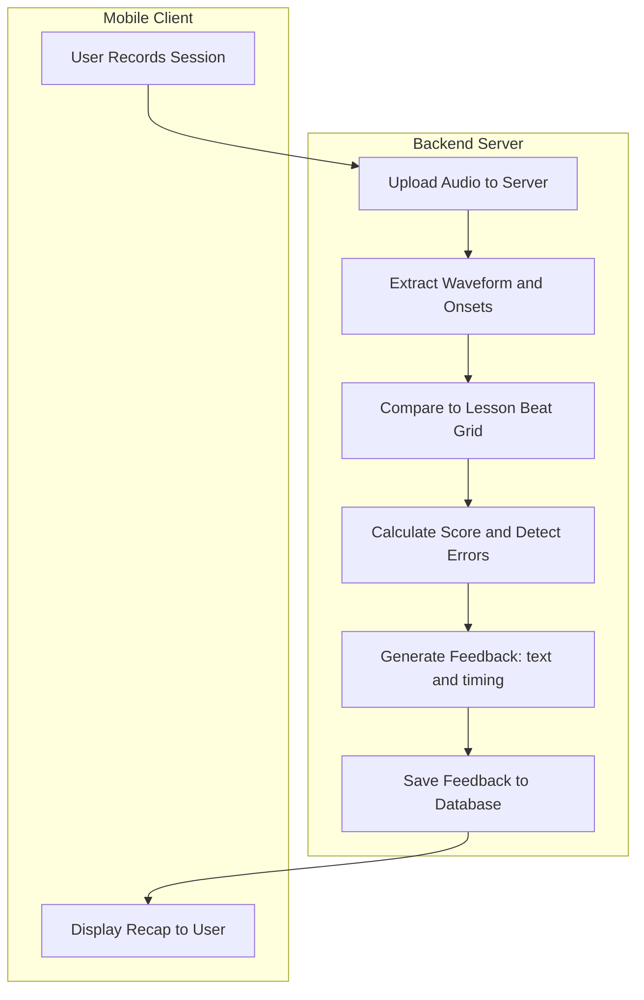

## 4.3 Gamification and Scoring System

Gamification in Beatquest is designed to enhance motivation and retention through visual progression, incremental challenges, and reward feedback loops.

### XP System and Level Curve

Each completed session grants XP based on the feedback score, and correct answers in quizzes also provide XP bonuses. The system follows a non-linear level curve:

| Level | Required XP | Cumulative XP | Badge Unlocked         |
|-------|-------------|---------------|------------------------|
| 1     | 0           | 0             | —                      |
| 2     | 100         | 100           | "Getting Started"      |
| 3     | 200         | 300           | "Beat Explorer"        |
| 4     | 400         | 700           | "Timing Technician"    |
| 5     | 600         | 1300          | "Rhythm Hero"          |
| 6     | 1000        | 2300          | "Mixmaster Apprentice" |

XP is earned as follows:

- Session Score ≥ 80: +100 XP
- Score between 50–79: +50 XP
- Score < 50: +10 XP + feedback summary
- Quiz correct answer: +20 XP
- Completing a lesson: +50 XP bonus

### Streak System and Achievements

- **Daily Streak:** Users earn bonus XP for returning daily, growing from +10 to +50 XP
- **Lesson Milestones:** Badges are awarded for 5, 10, 20 lessons completed
- **Performance Awards:** Earned for scoring 90+, reaching 10 consecutive sessions, or streaking 7+ days

This scoring system is both rewarding and instructional, nudging users toward consistent practice, mastery of skills, and structured progression without penalizing early mistakes.


### Visual Progression Flow

The following diagram illustrates a typical user journey through the gamification system, from completing lessons to gaining XP, unlocking badges, and progressing in level.

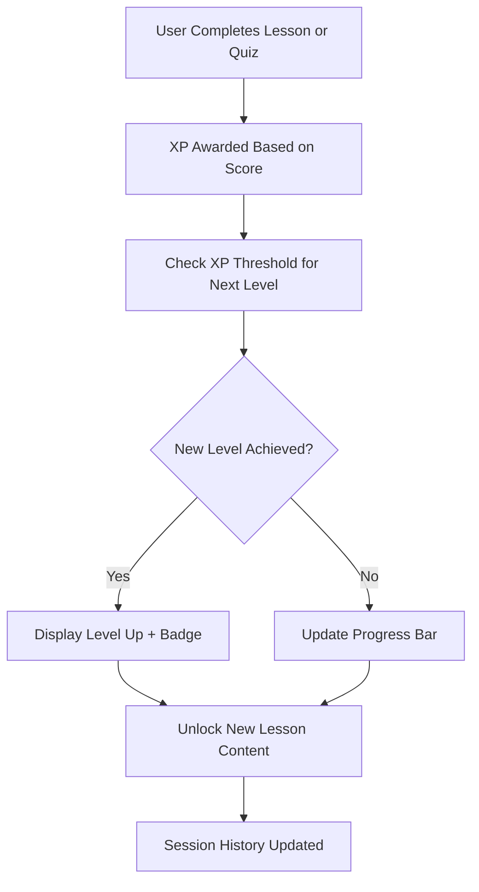

This visual flow makes it clear how engagement and progression are continuously reinforced through feedback and rewards, encouraging users to return and keep improving.

## 4.4 Technical Justification

The choice of technologies and algorithms balances performance, maintainability, and feasibility for solo development:

- **Python + Librosa** allowed rapid prototyping of audio analysis algorithms.
- **PostgreSQL** with RLS enabled secure user-level feedback storage.
- **Crow (C++)** backend supports fast request handling and future integration of C++ audio modules.
- Future improvements include porting the feedback engine to native mobile or WASM for full real-time interaction on-device.


# 5. Testing and Deployment Strategy

## 5.1 Unit and Integration Testing

Testing was a critical part of ensuring stability for Beatquest, especially given the multi-platform nature of the app. However, due to the limited time available and the interruption caused by medical recovery, most testing was performed manually, with a few automated test cases and a clear plan for future improvements.

### Manual Testing

- **API Routes:** All backend endpoints (`/register`, `/login`, `/me/sessions`, etc.) were tested using `curl` and Postman to validate response codes, payload formats, and authentication behavior.
- **Frontend Flows:** Core user flows (login, lesson navigation, quiz submission, session recording) were manually validated on both Android and iOS devices to check UI behavior, navigation, and integration with the backend.

### Example Manual Test Case

**Test:** User registers, logs in, and starts a session  
**Steps:**
1. `POST /register` → verify success and JWT token received  
2. `POST /login` → test login with same credentials  
3. `GET /me/sessions` → ensure empty session list is returned  
4. `POST /me/sessions` → upload test session JSON (mocked)  
5. `GET /me/sessions` → check if session is stored and accessible

### Future Testing Plans

Post-certification, the following improvements are planned:
- Unit tests for feedback scoring logic and session processing
- Widget tests for frontend components (e.g., lesson tree, quiz cards)
- CI-integrated API validation and regression testing

This progressive testing plan will ensure reliability and stability as Beatquest evolves into a more feature-rich and public-ready platform.

## 5.2 Audio Feedback Testing

Due to time constraints and health-related delays, the audio feedback engine could not be fully implemented or tested. No Python prototype was developed, and no deep benchmarking or algorithmic validation could be performed within the project timeline.

Nevertheless, a few manual test cases were constructed to simulate feedback logic in theoretical conditions:

- **Simulated Timing Variants:** Example waveforms were analyzed conceptually to define expected behavior (e.g., early beats, drift, silence).
- **Scoring Criteria Drafted:** Heuristics for tempo deviation, alignment, and session continuity were outlined for future development.
- **Feedback Types Drafted:** Template messages such as “Great sync” or “Off-beat near 00:45” were prepared, though not yet dynamically generated.

> ⚠️ The audio feedback feature remains in conceptual design and will be developed post-certification as part of the next roadmap phase.

## 5.3 Deployment Approach

While Beatquest is not intended for public release during the certification period, a deployment approach has been defined to support local development, testing, and future scalability.

### Current Setup (Local)

- **Backend:** Runs locally using Docker Compose, combining Crow (C++) API server and PostgreSQL database.
- **Frontend:** Deployed as a mobile app (Flutter) installed manually on Android or built with Xcode for iOS.
- **Database:** Versioned with SQL migration scripts and initialized via Docker.
- **Environment Management:** `.env` files control database URLs, JWT secrets, and service ports.

### Deployment Plan (Future)

- **VPS Hosting:** Backend and database to be deployed on an Ubuntu server (e.g., Hetzner, OVH, DigitalOcean).
- **Reverse Proxy:** Nginx configured with HTTPS (Let's Encrypt) to route frontend requests to backend endpoints.
- **Domain Name:** Dedicated domain (e.g., `beatquest.app`) linked to public backend API.
- **Mobile Builds:** Flutter APKs distributed via Firebase App Distribution or TestFlight for beta users.
- **Persistent Storage:** External volume mounting for audio files, logs, and user uploads.

### CI/CD Roadmap

The long-term plan includes CI/CD pipelines using GitHub Actions:

- On `push` to `main`:
  - Run backend tests and lint checks
  - Build and push Docker image to Docker Hub
  - Trigger staging deployment via webhook
- On Flutter changes:
  - Lint Dart code and run widget tests
  - Build APK and optionally upload to Firebase App Distribution
- Manual steps for production deployment (signed builds, version tagging)

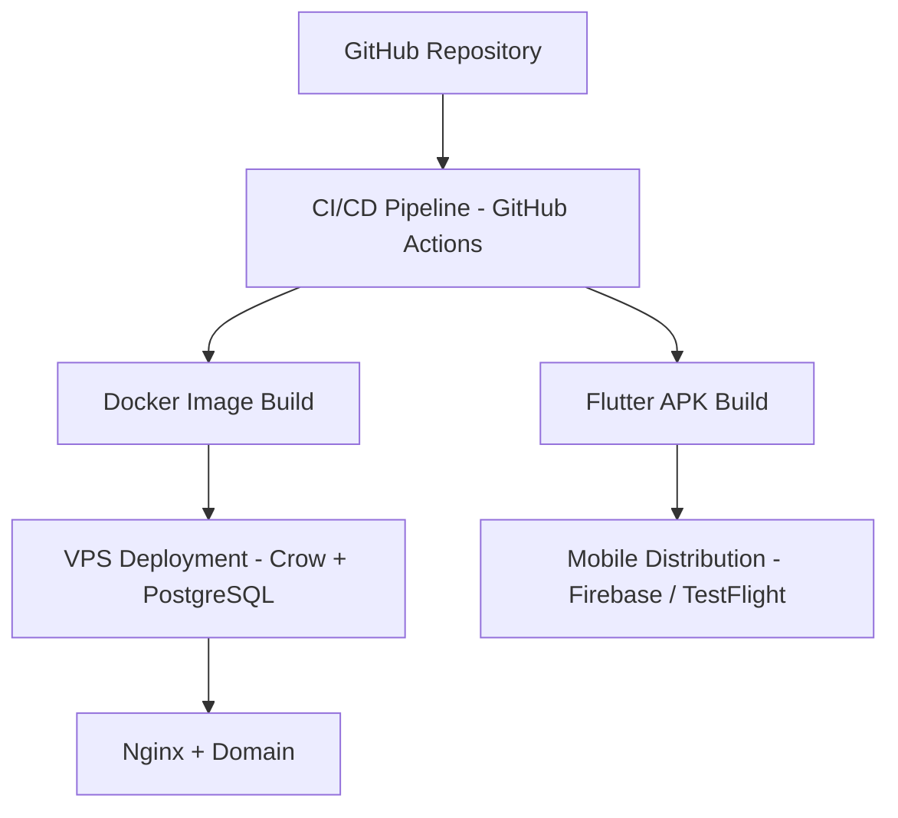

This structure enables clean separation between development, staging, and production environments, while ensuring reproducibility of builds and easier rollback.


## 5.4 CI/CD and Version Control

To ensure consistent development quality and collaboration readiness, the following practices were adopted:

- **Version Control:** All code and documentation are tracked via GitHub
- **Branching Strategy:** `main` for stable, `dev` for features, and topic branches for specific tasks
- **Manual CI:** Linting, build tests, and integration testing were performed before merging to `main`
- **Pre-release Tags:** Semantic versioning was followed with tags like `v0.9.0-beta`

The project is prepared for future automation using CI/CD pipelines, especially for:
- Auto-building APKs and Docker images
- Running full test suites on pull requests
- Generating versioned documentation PDFs for delivery


# 6. Software Evolutions

## 6.1 Completed Milestones

Despite a major medical disruption in the middle of the project timeline, the following deliverables were successfully completed and delivered for certification:

- ✅ **Mockups and User Flow Design (Weeks 1–2)**: Key screens and learning paths designed in Figma, with detailed UI flow and personas.
- ✅ **Backend API & Authentication (Weeks 3–5)**: All core routes (`/register`, `/login`, `/me/sessions`, etc.) developed with JWT protection and PostgreSQL integration.
- ✅ **Frontend MVP Interface (Weeks 6–9)**: Flutter app with login, dashboard, lesson navigation, and quiz screens. Core features are connected to the backend, while some visual and gamification elements remain in progress.
- ✅ **Database Schema & Security (Week 4)**: Normalized PostgreSQL schema with RLS policies and role separation for admin/user.
- ✅ **Documentation & Report (Weeks 10–11)**: Markdown-based technical report written and refined with diagrams and detailed architectural documentation.

## 6.2 Partially Completed or Postponed Features

Due to time constraints and the five-week disruption from surgery and recovery, some features were deprioritized or left incomplete. They are categorized below:

| Feature                            | Status         | Description                                                                 |
|------------------------------------|----------------|-----------------------------------------------------------------------------|
| Audio Feedback Engine              | ❌ Not Started  | No backend or frontend implementation. Only scoring logic was outlined.    |
| Advanced Gamification              | ⚠️ Partial      | XP and level system exists. Badges and streaks are mocked in UI only.      |
| Admin Panel (Lesson Management)    | ⚠️ Partial      | Lessons are loaded via static JSON. No admin interface or upload tool yet. |
| Unit & Integration Test Coverage   | ⚠️ Minimal      | Some API endpoints tested manually. No formal test suite or CI validation. |

Despite being postponed, all of these features are designed modularly and can be integrated into the current system without rework. Most codebase stubs and mockups have been prepared in anticipation of these future implementations.

## 6.3 Post-Certification Roadmap

| Phase                     | Target Date   | Key Deliverables |
|--------------------------|---------------|------------------|
| **Audio Engine Integration**   | July 2025     | Port analysis logic to native module<br>Embed results into session recap<br>Start scoring validation |
| **Gamification Completion**    | August 2025   | Activate streaks, XP syncing, rewards and badge logic<br>Connect leaderboard UI to backend scores |
| **Admin Dashboard**            | September 2025| Build web-based lesson editor<br>Role-based access and live quiz management |
| **Beta Testing Phase**         | October 2025  | Recruit users, fix bugs, gather feedback<br>Polish UI/UX and prep for submission |
| **Production Release Prep**    | Q4 2025       | CI/CD setup for final APKs<br>Store submission checklist<br>Public release on Play Store/TestFlight |

# 7. Conclusion and Acknowledgments

## 7.1 Project Timeline

The project officially started on **March 11, 2025**, and spanned **15 weeks** until the final presentation in late June. The idea had been validated by the project stakeholder in **November 2024**, and an initial version of the documentation was drafted in **December 2024** to anticipate the development phase.

> 🩺 **Medical Note**: On **December 28, 2024**, a complete tear of the right anterior cruciate ligament (ACL) initiated a major health disruption. The months of **January and February 2025** were focused on knee stabilization and inflammation reduction, in preparation for surgery. The operation, performed on **February 25**, led to complications and strong medication effects that extended into March and April. In total, approximately 5 weeks of effective production were lost, requiring a reduction in scope and prioritization of the core components for the final certification delivery.

| Week     | Planned Work                                                                 | Actual Progress        | Comments |
|----------|------------------------------------------------------------------------------|------------------------|----------|
| Week 1   | Define vision, scope, and UX references                                      | ✅ Completed            | Project kickoff: vision locked in |
| Week 2   | Figma wireframes + refine features                                           | ✅ Completed            | Lesson structure + mockups delivered |
| Week 3   | Technical architecture + dev environment                                     | ✅ Completed            | Crow, DB schema, JWT stack chosen |
| Week 4   | Backend core API + user/session/auth logic                                   | ✅ Completed            | JWT authentication, DB schema and core endpoints done |
| Week 5   | Complete backend, Crow-PostgreSQL integration                                | ✅ Completed            | Full API coverage and RLS policy scripts implemented |
| Week 6   | Frontend setup (Flutter) + MVP connection                                    | ✅ Completed            | Flutter scaffold, navigation and session API integration done |
| Week 7   | Resume: Flutter + RLS integration                                            | ✅ Completed            | UI connected to secured routes with token-based logic |
| Week 8   | Librosa audio pipeline (beat analysis, score)                                | ❌ Not completed        | Audio prototype postponed |
| Week 9   | Frontend practice: lesson nav, quiz, waveform feedback                       | ✅ Completed            | Lesson navigation, quiz screens, and waveform integration functional |
| Week 10  | Tests: API (Postman), frontend (Flutter), feedback scoring                   | ⚠️ Partial              | Basic API and UI tests run manually; deeper coverage postponed |
| Week 11  | Report writing (structure, diagrams, Mermaid)                                | ✅ Completed            | Markdown structure 80% done |
| Week 12  | Roadmap v1 + polishing phase                                                 | ⚠️ In progress          | Refinement ongoing |
| Week 13  | Oral presentation prep: structure, storyboarding                             | ⚠️ In progress          | Slide preparation underway |
| Week 14  | Final rehearsal, fix pitch timing                                            | 🔄 Upcoming             | Planned for final weekend |
| Week 15  | Final upload: GitHub repo, PDF, Q&A session                                  | 🔄 Upcoming             | Delivery scheduled |

### Gantt Overview – Initial Planning vs. Real Execution

To complement the project timeline table above, the following diagrams illustrate the initial plan and its real-world evolution. These visuals help contextualize the delivery delays and scope adaptation resulting from unforeseen medical events.

<p>
  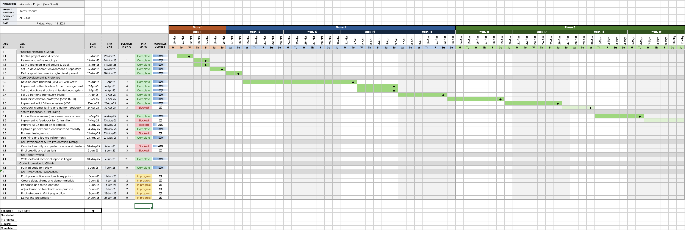
</p>

<p>
  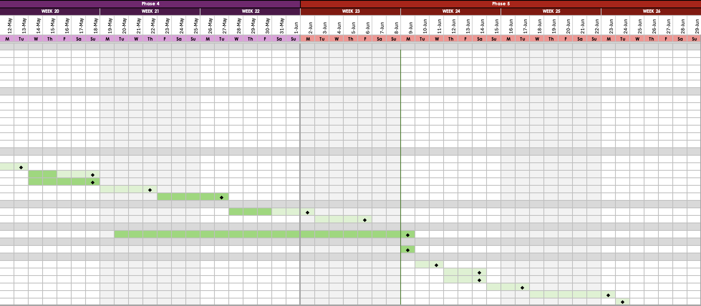
</p>

## 7.2 Lessons Learned

Developing Beatquest under the Moonshot program was both a technical and personal challenge. While the project had strong initial momentum, an unexpected ACL injury and its medical consequences forced a significant reevaluation of scope, priorities, and delivery strategy.

The most valuable lessons learned include:

- **Planning for the Unexpected**: Despite having an early Gantt chart and documentation from December, real-world setbacks demanded agility. I learned to re-prioritize ruthlessly and deliver a functional core rather than chase feature completeness.
- **Balancing Solo Workloads**: Managing backend, frontend, UX, and documentation alone required constant context-switching. I improved my ability to compartmentalize tasks and define strict daily focus areas.
- **Failing Gracefully**: Some ambitious goals (e.g., full audio engine integration, multiplayer mockups) were postponed. I learned that success sometimes means knowing what to drop or simplify under pressure.
- **Documentation as a Leadership Tool**: Writing detailed, structured reports helped clarify thinking, document trade-offs, and regain control during recovery phases.
- **Designing for Learnability**: Building a DJ learning tool forced me to think from the learner's point of view, simplifying UI and sequencing theory with practice in engaging ways.

This project tested not only my development skills, but also my resilience, organization, and ability to adapt. In the end, Beatquest stands as both a working prototype and a personal proof of endurance and iteration.

## 7.3 Risk Management and Adjustments

From the outset, the project was exposed to several risks — both predictable and unforeseen. These risks were identified, monitored, and in most cases mitigated through a combination of prioritization, documentation, and agile decision-making.

### Identified Risks and Responses

| Risk Type               | Description                                                                 | Response / Adjustment                                                    |
|------------------------|-----------------------------------------------------------------------------|---------------------------------------------------------------------------|
| **Medical Emergency**   | ACL tear and surgery caused a complete 5-week loss of productivity          | Re-scoped project to focus on core features and backend-first delivery    |
| **Solo Development**    | All backend, frontend, and design tasks had to be handled by one person     | Strict prioritization, simplified features, and use of frameworks/tools   |
| **Overengineering**     | Use of Crow (C++), PostgreSQL RLS, and audio analysis added complexity      | Dropped non-critical features (e.g., multiplayer, advanced audio graphs)  |
| **Real-Time Audio Complexity** | Real-time analysis is hard to prototype and test on mobile devices      | Shifted feedback engine to post-certification roadmap                     |
| **Deadline Pressure**   | June 9 delivery deadline for report, code, and oral defense                 | Reorganized timeline and focused on deliverables over polish              |

### Lessons in Risk Adaptation

Despite initial delays, key decisions helped the project survive under stress:
- Feature trimming allowed delivery of a working MVP instead of an incomplete full version.
- Written documentation was started early (December) and updated during downtime.
- Health recovery periods were used to plan, diagram, and document architecture.
- A modular design enabled decoupling of incomplete parts (audio, admin) from critical paths.

This experience highlighted the importance of adapting scope, protecting developer focus, and designing resilient development strategies even under unpredictable conditions.

## 7.4 Acknowledgments

This project would not have been possible without the support and input of:

- **Certification Supervisors** for guidance and feedback throughout the project.
- **Test Users and Peers** for their time and honest critiques during beta tests.
- **Open-Source Communities** behind Crow, Librosa, Flutter, and PostgreSQL.
- All those who contributed ideas, encouragement, or even bugs to debug along the way.


## 7.5 Conclusion

Beatquest represents more than just a prototype. It is a testament to resilience, thoughtful design, and creative engineering in the face of constraint. Born from passion and carefully scoped at the outset, the project was met with an intense and unforeseen challenge when a medical emergency sharply altered its course. Despite the loss of over five weeks of effective development, all essential components were integrated and a working, demonstrable product was delivered.

The process of building Beatquest provided profound lessons in software architecture and project stewardship. Navigating real-world adversity required making tough trade-offs, focusing on fundamentals over perfection, and sustaining motivation during difficult periods. The experience underscored the importance of modular design, thorough documentation, and early alignment with stakeholders.

While some features were necessarily postponed, the core goal to create a meaningful and educational DJ training experience was fully realized within this certification phase. Beatquest now rests on a solid technical foundation, well-positioned for future growth and public release.


# Glossary

This glossary defines key terms, acronyms, and technologies used throughout the Beatquest project report.

| Term / Acronym       | Definition                                                                 |
|----------------------|---------------------------------------------------------------------------|
| **Flutter**          | Open-source UI toolkit by Google for building natively compiled mobile apps from a single codebase. |
| **Crow**             | Lightweight C++ microframework used for building HTTP REST APIs.          |
| **JWT**              | JSON Web Token, a compact and secure method for transmitting authenticated user data. |
| **PostgreSQL**       | A powerful open-source relational database system with advanced features like RLS. |
| **RLS (Row-Level Security)** | Database mechanism that restricts access to specific rows based on user identity. |
| **Librosa**          | A Python library for music and audio analysis, used in prototyping feedback logic. |
| **REST API**         | An architectural style that uses HTTP methods to provide interoperability between client and server. |
| **XP (Experience Points)** | A gamification element that rewards users for completing lessons and challenges. |
| **CI/CD**            | Continuous Integration / Continuous Deployment – a practice to automate testing and deployment. |
| **Docker Compose**   | Tool for defining and running multi-container Docker applications, used for backend + DB setup. |