# Beatquest  
### Professional Certification Report  
*Submitted as part of the final evaluation for the Moonshot program.*

# Table of Contents

1. [Comprehensive Presentation of the Professional Project](#1-comprehensive-presentation-of-the-professional-project)
   - 1.1 Project Overview
   - 1.2 Target Audience and Educational Goals
   - 1.3 Key Features
   - 1.4 Individual Responsibility and Tools

2. [Analysis and Software Specifications](#2-analysis-and-software-specifications)
   - 2.1 Functional Requirements
   - 2.2 Technical and Non-Functional Requirements
   - 2.3 User Flow and Use Case Scenarios
   - 2.4 Project Constraints

3. [Software Architecture Choices](#3-software-architecture-choices)
   - 3.1 Global System Overview
   - 3.2 Frontend Architecture (Flutter)
   - 3.3 Backend Architecture (Crow / C++)
   - 3.4 Database Design and Security
   - 3.5 API Design

4. [Algorithm Selection and Relevance](#4-algorithm-selection-and-relevance)
   - 4.1 Beatmatching and BPM Detection
   - 4.2 Real-Time Feedback Logic
   - 4.3 Gamification and Scoring System
   - 4.4 Technical Justification

5. [Testing and Deployment Strategy](#5-testing-and-deployment-strategy)
   - 5.1 Unit and Integration Testing
   - 5.2 Audio Feedback Testing
   - 5.3 Deployment Approach
   - 5.4 CI/CD and Version Control

6. [Software Evolutions](#6-software-evolutions)
   - 6.1 Completed Milestones
   - 6.2 Planned Enhancements
   - 6.3 Post-Certification Roadmap

7. [Project Management and Execution](#7-project-management-and-execution)
   - 7.1 Project Timeline
   - 7.2 Workflow and Tools
   - 7.3 Risk Management and Adjustments
   - 7.4 Self-Evaluation and Autonomy

# 1. Comprehensive Presentation of the Professional Project

## 1.1 Project Overview

Beatquest is a mobile application developed to teach users the fundamentals and techniques of DJing through an interactive and gamified learning experience. The project was born from the observation that most DJ training today is either expensive, too technical for beginners, or lacks real feedback on performance. Beatquest fills that gap by offering a structured progression system, real-time audio analysis, and a user-friendly interface for both theoretical learning and hands-on practice.

> 🟨 **TO DO:** Add a visual mockup or screen capture of the home screen and lesson navigation in the app.

## 1.2 Target Audience and Educational Goals

The application is intended for complete beginners to intermediate-level learners who want to gain DJ skills from scratch or improve their technique. It targets users who may not have access to physical DJ equipment or formal training but are passionate about music and willing to learn independently. The app aims to:
- Make DJing accessible and affordable
- Provide a structured learning path with increasing difficulty
- Offer feedback mechanisms to help users self-correct
- Create a motivating learning environment through gamification

## 1.3 Key Features

Beatquest includes the following core features:
- **Interactive Lessons:** Modular content combining theory and practice
- **Quizzes & Challenges:** Reinforce theoretical understanding and reward progress
- **Real-Time Audio Feedback:** Analyze BPM, beatmatching, and timing
- **Gamification:** Level-up system, XP rewards, streaks, and progress tracking
- **User Profile & History:** Track completed lessons, scores, and feedback
- **Session Playback:** Users can listen back to their performances

The diagram below shows how Beatquest’s core features directly support the educational goals of the application. It visually links user expectations with the features implemented to fulfill them.


## 1.4 Individual Responsibility and Tools

This project was developed individually over a span of several weeks. The following tasks were performed entirely by the author:
- Market analysis and feature definition
- Mockups and UX flow (Figma)
- Frontend development with Flutter
- REST API development using Crow (C++)
- Database setup with PostgreSQL and RLS policies
- Basic AI prototype using Librosa for audio feedback
- Testing with curl, Postman, and manual QA
- Project documentation and report writing

Main tools and technologies used:
- Flutter, Dart
- Crow C++ framework
- PostgreSQL + Docker Compose
- Git & GitHub (for CI and versioning)
- Notion, Figma, VS Code

The diagram below presents the main development phases of the Beatquest project, offering a simple view of how the project evolved from idea to delivery.


# 2. Analysis and Software Specifications

## 2.1 Functional Requirements

The main features required for Beatquest were identified during early benchmarking and user analysis:

- **User Account Management:** Users can register, log in, and securely access their data.
- **Lesson Navigation:** Users progress through lessons that include theory, practice, and quizzes.
- **Audio Feedback Engine:** The app processes real-time audio to provide feedback on beatmatching and timing.
- **Gamification System:** Users earn XP, unlock levels, and maintain streaks.
- **Session Tracking:** Playback and results are stored and displayed in user profiles.
- **Admin Content Management:** Admins can add, remove, or update lesson content dynamically.

## 2.2 Technical and Non-Functional Requirements

### Technical Requirements:
- **Cross-platform Compatibility:** Flutter ensures native performance on both Android and iOS.
- **API Integration:** Communication between frontend and backend via REST.
- **Secure Authentication:** JWT-based authentication system.
- **Database:** PostgreSQL with Role-Level Security (RLS) to isolate user data.

### Non-Functional Requirements:
- **Responsiveness:** Smooth and reactive UI on all screen sizes.
- **Low Latency:** Audio feedback must process input with minimal delay.
- **Scalability:** The backend architecture should support future features like multiplayer or cloud storage.
- **Data Privacy:** Each user's session history and profile must be protected and isolated.

| Requirement Type             | Feature / Concern                                                       | Description                                                                                  |
|-----------------------------|--------------------------------------------------------------------------|----------------------------------------------------------------------------------------------|
| Functional Requirement       | User Account Management                                                  | Users can register, log in, and manage their secure personal data.                          |
| Functional Requirement       | Lesson Navigation                                                        | Users access and navigate through a structured lesson sequence (theory + practice).         |
| Functional Requirement       | Quizzes and Challenges                                                   | Users validate their understanding through interactive questions and challenges.            |
| Functional Requirement       | Audio Feedback Engine                                                    | Real-time processing of the user's mix to detect timing and beatmatching accuracy.          |
| Functional Requirement       | Gamification System                                                      | Users gain XP, unlock new levels, and track progress through a gamified interface.          |
| Functional Requirement       | Session Tracking                                                         | Playback of recorded sessions and display of results in the user profile.                   |
| Functional Requirement       | Admin Content Management                                                 | Admins can upload, delete, and update lesson materials dynamically.                         |
| Non-Functional Requirement   | Cross-Platform Compatibility                                             | The app must work on both Android and iOS devices using Flutter.                            |
| Non-Functional Requirement   | Secure Authentication                                                    | JWT tokens are used to protect user sessions and route access.                              |
| Non-Functional Requirement   | Low Latency Audio Processing                                             | Audio input and feedback must be near real-time for effective user correction.              |
| Non-Functional Requirement   | UI Responsiveness                                                        | Interface should be smooth, adaptive to screen size, and load content quickly.              |
| Non-Functional Requirement   | Data Privacy & Security                                                  | User data must be securely stored and isolated using PostgreSQL RLS policies.               |
| Non-Functional Requirement   | Scalable Backend                                                         | The backend structure must allow future evolution (e.g., multiplayer mode, cloud sync).     |
| Non-Functional Requirement   | Maintainability                                                          | The codebase should be modular, documented, and easy to update or extend.                   |
| Non-Functional Requirement   | Offline Usage (Optional Future Goal)                                     | Basic lesson content should remain accessible offline for better accessibility.             |

## 2.3 User Flow and Use Case Scenarios

The following diagram illustrates the main user journey from app launch to feedback:


> 🟨 **TO DO:** Add real screenshots of user onboarding and lesson selection screens.

## 2.4 Project Constraints

- **Solo Developer:** All aspects of development (design, backend, frontend, AI) were handled by a single person, requiring time prioritization and scope control.
- **Time Limit:** The project had to be completed and presented by June 23, 2025, with a feature-complete build by June 9.
- **Hardware Limitations:** Audio feedback had to be designed for standard smartphones without external DJ controllers.
- **Budget Constraints:** The project was developed with minimal financial resources, relying on free or open-source tools and libraries.
- **Technical Complexity:** Implementing real-time audio analysis and feedback required careful selection of libraries and optimization for mobile performance.


# 3. Software Architecture Choices

## 3.1 Global System Overview

Beatquest follows a modular, service-oriented architecture that separates concerns between frontend, backend, database, and AI components. This decoupling enables independent development, easier testing, and potential future scalability (e.g., adding a web interface or multiplayer mode).

The overall architecture is composed of the following layers:
- **Frontend:** Developed in Flutter to run on Android and iOS.
- **Backend API:** Built with the Crow framework in C++ for high performance and minimal memory usage.
- **Database:** PostgreSQL, using RLS (Row-Level Security) for secure and isolated user data.
- **Audio Processing Prototype:** Developed with Python and Librosa during the prototyping phase, with planned migration to WebAssembly or mobile-native C++.

The following diagram illustrates the main components and their interactions in the Beatquest architecture:


## 3.2 Frontend Architecture (Flutter)

The frontend is a mobile application developed in Flutter. It uses:
- **Riverpod** for state management
- **Navigator 2.0** for page routing and dynamic lesson flows
- **Custom Widgets** for decks, waveforms, and BPM indicators
- **REST API integration** with async handling using `http` and `dio`

UI is structured into modules (Home, Lessons, Session Playback, Profile). Each module is reactive and supports responsive layout for different screen sizes.

The following diagram illustrates the main UI modules and navigation logic in the Beatquest Flutter app:


## 3.3 Backend Architecture (Crow / C++)

The backend is built with the lightweight Crow web framework, selected for its speed, minimalism, and native C++ compatibility with potential real-time audio modules. It includes:
- **JWT authentication middleware**
- **RESTful routes**: `/register`, `/login`, `/me/sessions`, `/lessons`, `/leaderboard`
- **Layered codebase**: routing layer, services (logic), and data access objects
- **JSON responses** using Crow's integrated serializers

All endpoints are tested using curl/Postman and validated against typical edge cases (missing fields, invalid tokens, unauthorized access).

The following diagram shows the main backend API routes, their controllers, and the flow through services and modules:

```mermaid
graph TD
    A[API Entry - Crow Router] --> B[Auth Controller]
    A --> C[Session Controller]
    A --> D[Lesson Controller]
    A --> E[Leaderboard Controller]

    subgraph Auth Controller
        B --> B1[POST /register → RegisterService]
        B --> B2[POST /login → AuthService]
    end

    subgraph Session Controller
        C --> C1[GET /me/sessions → SessionService]
        C --> C2[POST /me/sessions → UploadSessionService]
        C2 --> C3[Process Audio → AudioAnalysisModule]
        C3 --> C4[Store Feedback → FeedbackDAO]
    end

    subgraph Lesson Controller
        D --> D1[GET /lessons → LessonListService]
        D --> D2[GET /lessons/:id → LessonDetailService]
    end

    subgraph Leaderboard Controller
        E --> E1[GET /leaderboard → ScoreAggregationService]
    end
```



## 3.4 Database Design and Security

The application uses PostgreSQL with:
- **Structured schema**: tables for users, sessions, lessons, scores
- **Row-Level Security (RLS)**: enforced per user to ensure data isolation
- **Role separation**: admin (read/write all), user (read/write own), and anonymous (register only)
- **Migration scripts** using SQL files for reproducibility and version control

The following ER diagram presents the main tables and relationships in the Beatquest PostgreSQL schema:


## 3.5 API Design

The REST API adheres to RESTful conventions:
- **Stateless requests**, always authorized with JWT in the header
- **Clear naming conventions**, e.g., `GET /lessons/:id`, `POST /me/sessions`
- **Error handling** with standardized JSON error responses
- **Secure access control**, thanks to token validation and DB role enforcement

Example response structure:
```json
{
  "success": true,
  "data": {
    "session_id": "abc123",
    "score": 85,
    "feedback": "Try to align beats earlier in the intro."
  }
}
```

> 🟨 **TO DO:** Include sample request/response pairs in a dedicated appendix or annex.


# 4. Algorithm Selection and Relevance

## 4.1 Beatmatching and BPM Detection

During early development, multiple algorithmic approaches were explored for detecting BPM and assessing beat alignment accuracy. The current prototype uses **Librosa**, a Python audio analysis library, to detect tempo and beat positions from recorded user sessions.

- **BPM Estimation** is done using Librosa's `tempo` function, which applies a short-time Fourier transform and onset envelope detection.
- **Beat Alignment** is analyzed by comparing expected beat grids from the lesson content against the user's waveform.
- **Limitations:** The Python-based implementation has limitations on mobile and will be migrated to a native C++ or WASM module for performance and cross-platform compatibility.

## 4.2 Real-Time Feedback Logic

Real-time feedback is crucial for DJ training. The implemented prototype uses a pipeline where uploaded audio is analyzed server-side after session completion:

- Detects timing accuracy, downbeat alignment, and beatmatching stability.
- Generates a **score** (out of 100) and **textual feedback** (e.g., “Great sync”, “Missed beat at 1:25”).
- Highlights waveform regions with timing issues for user review.

The scoring formula combines:
- BPM Consistency (40%)
- Beat Grid Alignment (40%)
- Session Continuity (20%)


## 4.3 Gamification and Scoring System

Gamification relies on a dynamic XP and level system:
- Each completed session grants XP based on the feedback score.
- Correct quiz answers provide XP bonuses.
- Lesson trees unlock progressively, ensuring users can’t skip foundational skills.

Level thresholds follow an exponential XP curve (e.g., Level 1: 0 XP, Level 2: 100 XP, Level 3: 300 XP, etc.).

A streak system encourages daily practice, and achievements are awarded based on session count, score milestones, and lesson completion.

## 4.4 Technical Justification

The choice of technologies and algorithms balances performance, maintainability, and feasibility for solo development:

- **Python + Librosa** allowed rapid prototyping of audio analysis algorithms.
- **PostgreSQL** with RLS enabled secure user-level feedback storage.
- **Crow (C++)** backend supports fast request handling and future integration of C++ audio modules.
- Future improvements include porting the feedback engine to native mobile or WASM for full real-time interaction on-device.


# 5. Testing and Deployment Strategy

## 5.1 Unit and Integration Testing

Testing was a critical part of ensuring stability for Beatquest, especially considering the audio and state-dependent nature of the app. The following strategies were employed:

- **Unit Tests (Flutter):** Core services such as API clients, lesson parsing logic, and scoring formulas were tested using `flutter_test`.
- **Integration Tests:** Navigation between pages, session flows, and interaction with REST endpoints were tested with `integration_test`.
- **Backend Testing:** All API routes were tested using `curl` and Postman, verifying response codes, payload structure, and authentication behavior.
- **Manual QA:** Performed on both Android and iOS emulators, as well as real devices to identify audio latency, UI bugs, and platform inconsistencies.

## 5.2 Audio Feedback Testing

Testing the audio feedback pipeline required both synthetic and real audio inputs:

- **Synthetic Tracks:** Artificial test mixes with predefined BPM and beat positions were used to benchmark accuracy.
- **User Recordings:** Sessions from beta testers were uploaded and analyzed for detection success and scoring consistency.
- **Edge Case Handling:** Silence, noise, and off-tempo mixes were intentionally introduced to validate robustness of the beat alignment logic.

Feedback accuracy was evaluated with metrics:
- **Detection Rate:** % of on-beat events correctly identified
- **False Positives:** % of beats falsely marked as incorrect
- **Latency:** Time between audio upload and feedback delivery

## 5.3 Deployment Approach

While Beatquest is not intended for public release during certification, a local deployment strategy was adopted:

- **Backend:** Hosted locally or on internal VPS using Docker Compose (API + DB containers)
- **Frontend:** Built APKs and tested via direct installation on Android, and Xcode builds for iOS
- **Database:** Versioned SQL migration scripts allowed reproducible deployments
- **Testing Scripts:** Automated tests could be run locally via `make test`, `flutter test`, and Postman collections

> 🟩 Future enhancement: Add CI workflows with GitHub Actions for linting, testing, and Docker image build/push.


## 5.4 CI/CD and Version Control

To ensure consistent development quality and collaboration readiness, the following practices were adopted:

- **Version Control:** All code and documentation are tracked via GitHub
- **Branching Strategy:** `main` for stable, `dev` for features, and topic branches for specific tasks
- **Manual CI:** Linting, build tests, and integration testing were performed before merging to `main`
- **Pre-release Tags:** Semantic versioning was followed with tags like `v0.9.0-beta`

The project is prepared for future automation using CI/CD pipelines, especially for:
- Auto-building APKs and Docker images
- Running full test suites on pull requests
- Generating versioned documentation PDFs for delivery


# 6. Software Evolutions

## 6.1 Completed Milestones

The following major milestones were reached during the certification timeline:

- **Mockup and UX Flow Completion** (Week 1–2): Wireframes for navigation, lessons, and profile features built in Figma.
- **Backend API Implementation** (Week 3–4): All REST endpoints developed and tested with JWT authentication and secure database access.
- **Frontend Development (MVP)** (Week 4–6): Flutter interface implemented with lesson navigation, user profiles, and playback module.
- **Audio Feedback Engine Prototype** (Week 6): Librosa-based backend scoring and feedback system integrated into user sessions.
- **Testing & Report Writing** (Week 7): Full manual and automated testing completed; documentation and report finalized for certification.

## 6.2 Planned Enhancements

Following certification, several improvements are planned to elevate Beatquest to a full-fledged learning platform:

- **Mobile-Native Audio Engine**: Replace the current Python-based analysis with a native C++ or WebAssembly module for real-time feedback directly on mobile.
- **Enhanced Quiz Types**: Add image-based, audio-sample, and drag-and-drop questions for deeper engagement.
- **User Sharing & Leaderboards**: Allow users to publish performances, compete with friends, and view global rankings.
- **Lesson Authoring Tool**: Create a web-based admin panel for instructors to easily build new lessons and challenges.
- **Multiplayer Mode**: Introduce live DJ duels with synced virtual decks and real-time scoring.

## 6.3 Post-Certification Roadmap

The long-term roadmap for Beatquest envisions its transformation from a functional prototype into a scalable, feature-rich application for aspiring DJs. Each phase builds upon user feedback and technical iteration.

| Phase           | Timeline       | Key Deliverables |
|----------------|----------------|------------------|
| **Alpha v1.0** | July 2025      | - Audio engine refactored in native C++ or WASM<br>- UX enhancements based on initial feedback<br>- Internal bug fixes and performance improvements |
| **Beta Launch** | August 2025    | - Invite-only external testing campaign<br>- XP system refined and full leaderboard integration<br>- Expanded lesson catalog with intermediate-level challenges |
| **Creator Tools** | September 2025 | - Web-based admin panel for lesson authors<br>- JSON import/export of lesson data<br>- Analytics dashboard for monitoring learner progress |
| **Multiplayer Module** | Q4 2025 | - Real-time peer-to-peer DJ battles<br>- Matchmaking and scoring logic<br>- Live waveform and beat grid synchronization between users |
| **App Store Prep** | Q1 2026 | - Accessibility & localization compliance<br>- Battery usage and size optimization<br>- iOS TestFlight and Android Closed Beta releases<br>- App Store and Play Store deployment (v1.0) |


# 7. Conclusion and Acknowledgments

## 7.1 Final Thoughts on Beatquest

Beatquest began as a simple idea: to make DJing accessible, interactive, and fun for learners of all levels. Throughout the project, we transformed this vision into a tangible prototype, combining real-time audio analysis, gamified progression, and responsive UI design. The result is a unique educational tool that empowers users to practice, evaluate, and improve their DJ skills anywhere, anytime.

This project pushed technical boundaries in both backend architecture and frontend performance, while maintaining a strong focus on pedagogical value. Despite the limited development time, Beatquest demonstrates the feasibility and potential of AI-driven music education.

## 7.2 Lessons Learned

Developing Beatquest provided valuable experience in:

- Designing full-stack architectures tailored to audio applications.
- Managing project scope and milestones under strict certification deadlines.
- Implementing secure authentication and scalable REST APIs.
- Handling real-time data (audio) with feedback mechanisms.
- Designing with end-user experience in mind across platforms.

The integration of audio signal processing, user feedback loops, and Flutter-based UI posed real challenges that were tackled iteratively, offering significant learning opportunities in software design, testing, and delivery.

## 7.3 Acknowledgments

This project would not have been possible without the support and input of:

- **Certification Supervisors** for guidance and feedback throughout the project.
- **Test Users and Peers** for their time and honest critiques during beta tests.
- **Open-Source Communities** behind Crow, Librosa, Flutter, and PostgreSQL.
- All those who contributed ideas, encouragement, or even bugs to debug along the way.

Beatquest is only the beginning — a stepping stone toward reimagining how we learn, play, and interact with music in the digital age.